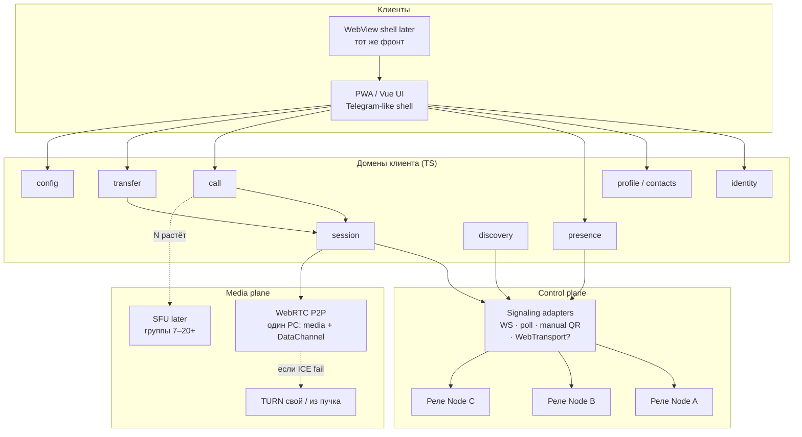
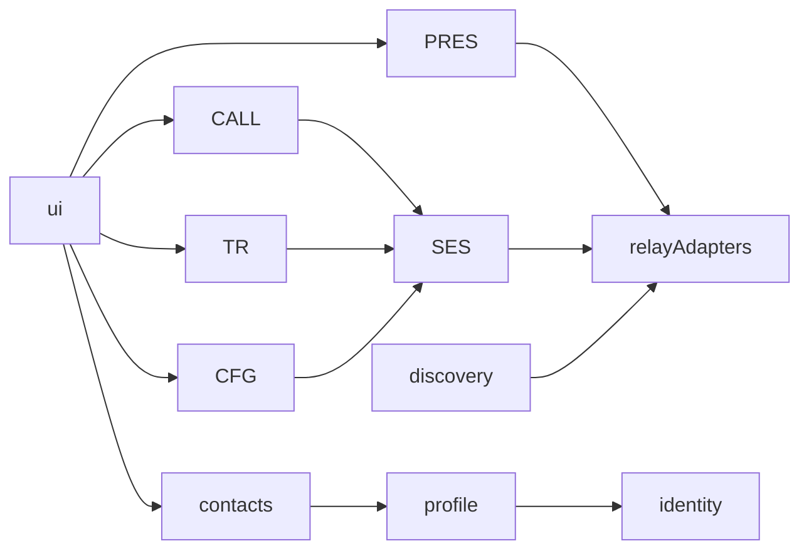
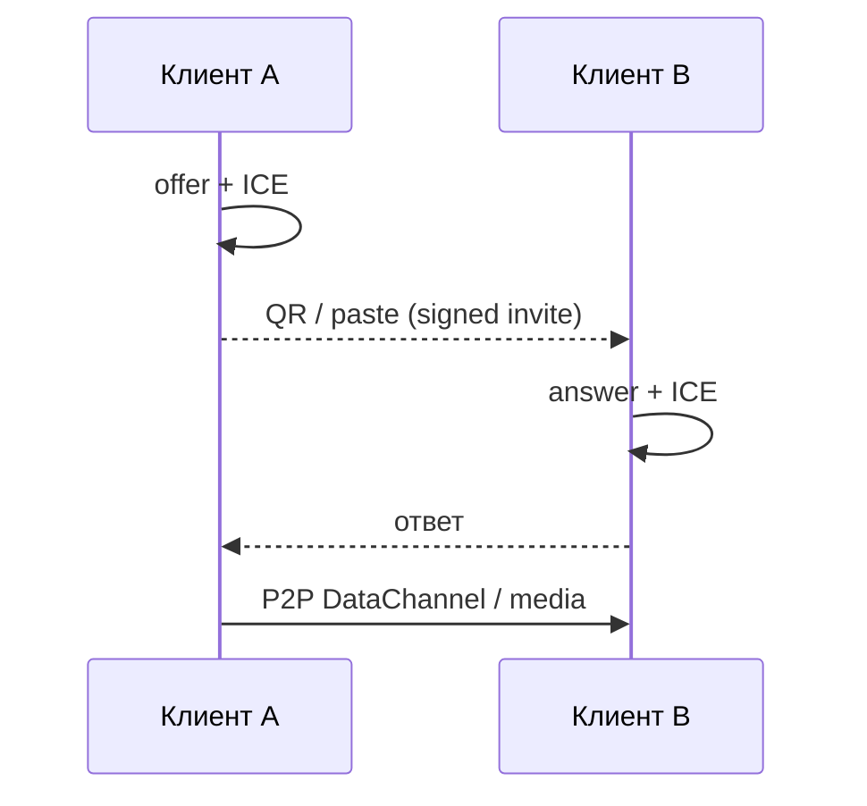
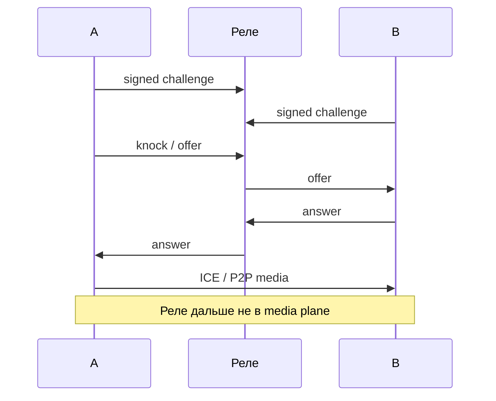
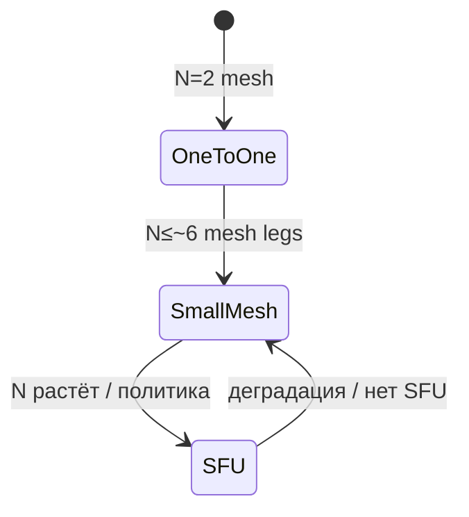

# Архитектура и системный дизайн NoCloud

Для новых разработчиков: сначала [glossary.md](./glossary.md), затем этот файл, потом [requirements.md](./requirements.md).  
Интерактивная схема рядом с чатом Cursor: [NoCloud System Design](/Users/org-event/.cursor/projects/Users-org-event-git-step-pwa-no-cloud/canvases/NoCloud-System-Design.canvas.tsx) (для IDE). В git для всех — этот файл с Mermaid.

---

## 1. Одна картина



**Правило:** стрелки control и media разделены. Блокировка реле ≠ обязательно обрыв уже установленного P2P.

---

## 2. Что есть что (клиент ≠ сервер)

| кусок | роль | стек MVP |
|---|---|---|
| **PWA клиент** | UI + домены + WebRTC | Vue + TypeScript + Vite+ |
| **Реле (Node тонкий)** | presence, signaling, peer-list, challenge | `server/` на Node.js |
| **STUN/TURN** | ICE / запасной медиа-путь | coturn или capability реле |
| **WebView later** | тот же клиент в apk/desktop shell | Capacitor / Tauri WebView |

Реле **не** является «бэкендом мессенджера с аккаунтами». Это сменный почтальон control-plane.

---

## 3. Модули клиента и зависимости



Запрещены циклы. UI не импортирует SDP/crypto напрямую — только фасады доменов.

Целевые папки (эволюция текущего `src/`):

```
src/
  domain/     identity profile contacts call presence transfer session …
  lib/        webrtc ice signaling/* opfs chunk crypto …
  ui/         telegram-like screens
  config/
server/       тонкое реле (Node), контракт стабилен
```

Организация по духу OpenPolySphere: явные границы + ADR, даже если пока не cargo-workspace.

---

## 4. Потоки

### 4.1 Знакомство (QR, без реле)



### 4.2 Звонок через реле



### 4.3 Рост группы (задел)



---

## 5. Отказоустойчивость (заложено сразу)

1. Несколько реле (до 3 активных) + пучок в кэше.  
2. Media предпочитает P2P; TURN только явно.  
3. Call = multi-leg с первого дня (MVP использует 1 leg).  
4. Topology strategy: `mesh` | `sfu` (sfu later).  
5. Signaling adapters: manual · WS · (WebTransport/QUIC когда уместно).  
6. Антиабьюз: rate-limit + pubkey сейчас; PoW — слот в интерфейсе.

---

## 6. Безопасность (кратко)

- Identity офлайн; реле не выдаёт «логин».  
- Профили/инвайты подписаны.  
- Ключ локально под master/BIP39; бэкап только шифрованный.  
- Чужой TURN по умолчанию запрещён.  
- Threat model: случайный админ реле / фишинг ника — да; «неубиваемость против DPI» — не обещание M1.

---

## 7. Документы рядом

| файл | зачем |
|---|---|
| [glossary.md](./glossary.md) | термины по-русски |
| [requirements.md](./requirements.md) | FR/NFR и решения A/B |
| [vision.md](./vision.md) | куда идём |
| [roadmap-wide.md](./roadmap-wide.md) | шаги |
| [adr/](./adr/) | почему решили так |
| [plan.md](./plan.md) | фундамент файлов WebRTC |
